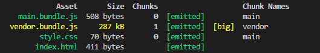
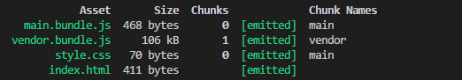

### webpack
this's a cute&awesome webpack template.
### TODO
- [ ] add `React 16.x` + `Redux` + `React-Router4.x`
- [ ] add `React Server Rendering`
### plugins
- [webpack](https://github.com/webpack/webpack)
- [webpack-merge](https://github.com/survivejs/webpack-merge)
- [html-webpack-plugin](https://github.com/jantimon/html-webpack-plugin)
- [clean-webpack-plugin](https://github.com/johnagan/clean-webpack-plugin)
- [extract-text-webpack-plugin](https://github.com/webpack-contrib/extract-text-webpack-plugin)
## production or development
### default config

### when i add `process.env.production`

```
plugins: [
    new webpack.DefinePlugin({
        'process.env': {
            NODE_ENV: '"production"'
        }
    })
]
```