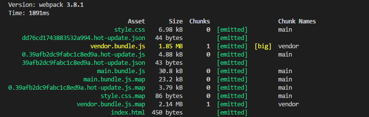
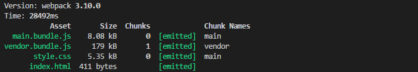

### webpack-typescpt-react
this's a cute&awesome webpack-typescpt-react todos app.
### TODO
- [x] add `React 16.x` + `Redux` + `React-Router4.x`
- [ ] add `Progressive Web App`
- [ ] add `React Server Rendering`
### plugins
- [webpack](https://github.com/webpack/webpack)
- [webpack-merge](https://github.com/survivejs/webpack-merge)
- [html-webpack-plugin](https://github.com/jantimon/html-webpack-plugin)
- [clean-webpack-plugin](https://github.com/johnagan/clean-webpack-plugin)
- [babili-webpack-plugin](https://github.com/cruzlauroiii/babili-webpack-plugin)
- [extract-text-webpack-plugin](https://github.com/webpack-contrib/extract-text-webpack-plugin)
- [babel-minify-webpack-plugin](https://github.com/webpack-contrib/babel-minify-webpack-plugin)
- [optimize-css-assets-webpack-plugin](https://github.com/NMFR/optimize-css-assets-webpack-plugin)
### [Development](https://github.com/ReySun/webpack-typescript-react/blob/master/screenshots/dev_ui_1.png)

### Production
